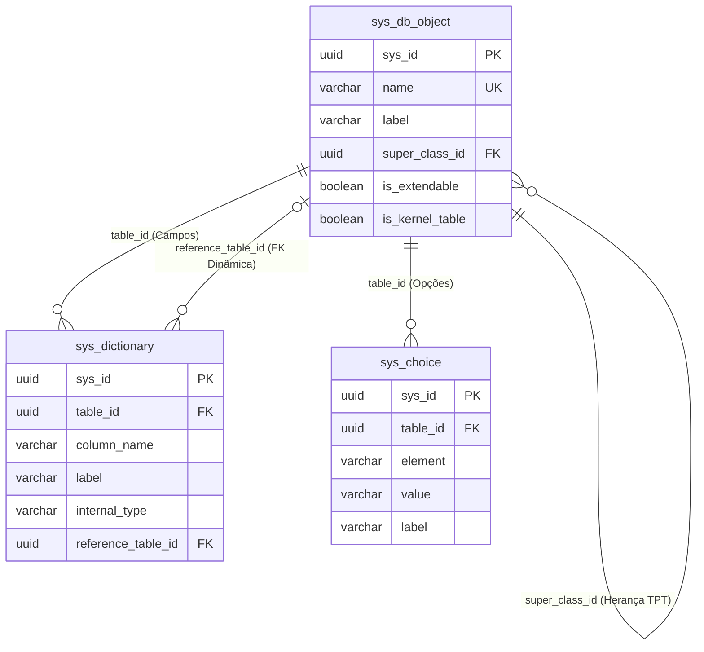
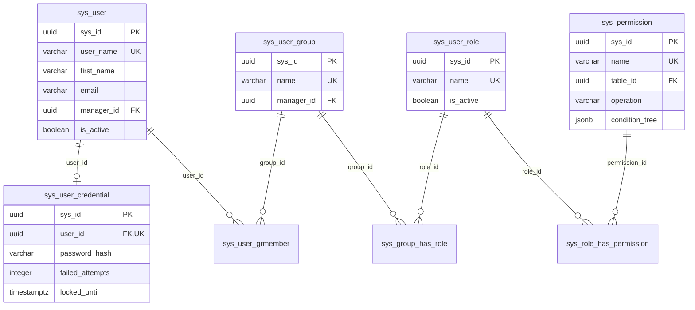
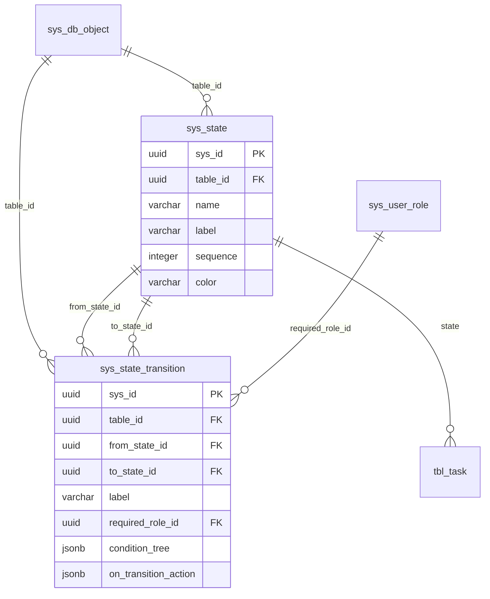
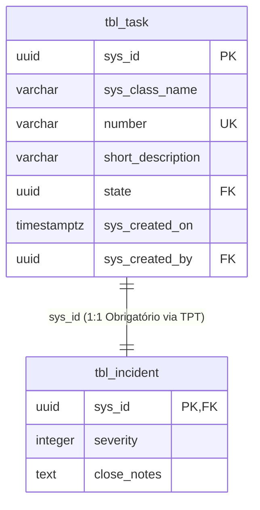

# Diagrama de Entidade-Relacionamento (ERD) - TableEngine

Este documento apresenta a modelagem completa do banco de dados do **TableEngine**, estruturado sobre PostgreSQL com arquitetura aPaaS orientada a metadados e persistência dinâmica **Table-per-Type (TPT)**.

---

## 1. Visão Geral do Banco de Dados

O banco de dados é dividido em quatro camadas principais:

1. **Kernel de Metadados & Dicionário de Dados**: Catálogo dinâmico de tabelas, campos, herança e listas de opções.
2. **Segurança, Identidade & Controle de Acesso (RBAC)**: Usuários, credenciais, grupos, papéis e permissões com condition tree.
3. **Ciclo de Vida, FSM, Regras & Numeração**: Estados, transições de estado, numeração sequencial automática e business rules.
4. **Trilha de Auditoria & Domínio de Negócio (TPT)**: Log de alterações campo a campo (`sys_audit`) e tabelas de negócio dinâmicas (`tbl_task`, `tbl_incident`).

> **Nota sobre campos de rastreamento universal**: Quase todas as tabelas do sistema possuem `sys_created_by` e `sys_updated_by` referenciando `sys_user(sys_id)` com integridade referencial (`ON DELETE RESTRICT`). Para manter a legibilidade dos diagramas, essas referências de autoria comuns estão documentadas nos atributos e as relações principais de domínio são destacadas nas conexões.

---

## 2. Diagrama ER Completo (Mermaid)

```mermaid
erDiagram
    %% ========================================================
    %% KERNEL & METADADOS
    %% ========================================================
    sys_db_object ||--o{ sys_db_object : "super_class_id (heranca)"
    sys_db_object ||--o{ sys_dictionary : "table_id"
    sys_db_object ||--o{ sys_choice : "table_id"
    sys_db_object ||--o{ sys_permission : "table_id"
    sys_db_object ||--o{ sys_number : "table_id"
    sys_db_object ||--o{ sys_state : "table_id"
    sys_db_object ||--o{ sys_state_transition : "table_id"
    sys_db_object ||--o{ sys_script : "table_id"
    sys_dictionary }o--o| sys_db_object : "reference_table_id"

    %% ========================================================
    %% IDENTIDADE & RBAC
    %% ========================================================
    sys_user ||--o{ sys_user : "manager_id"
    sys_user ||--o| sys_user_credential : "user_id"
    sys_user ||--o{ sys_user_group : "manager_id"
    sys_user ||--o{ sys_user_grmember : "user_id"
    sys_user_group ||--o{ sys_user_grmember : "group_id"
    sys_user_group ||--o{ sys_group_has_role : "group_id"
    sys_user_role ||--o{ sys_group_has_role : "role_id"
    sys_user_role ||--o{ sys_role_has_permission : "role_id"
    sys_permission ||--o{ sys_role_has_permission : "permission_id"

    %% ========================================================
    %% NUMERAÇÃO AUTOMÁTICA
    %% ========================================================
    sys_number ||--|| sys_number_counter : "number_id"

    %% ========================================================
    %% FSM / MÁQUINA DE ESTADOS
    %% ========================================================
    sys_state ||--o{ sys_state_transition : "from_state_id"
    sys_state ||--o{ sys_state_transition : "to_state_id"
    sys_user_role ||--o{ sys_state_transition : "required_role_id"

    %% ========================================================
    %% AUDITORIA & SCRIPTS
    %% ========================================================
    sys_user ||--o{ sys_audit : "changed_by"
    sys_user ||--o{ sys_script : "run_as_user_id"

    %% ========================================================
    %% TABELAS DE NEGÓCIO & TPT (HERANÇA)
    %% ========================================================
    tbl_task ||--|| tbl_incident : "sys_id (heranca TPT)"
    sys_state ||--o{ tbl_task : "state"
    sys_user ||--o{ tbl_task : "sys_created_by"
    sys_user ||--o{ tbl_task : "sys_updated_by"

    %% ========================================================
    %% DEFINIÇÃO DAS ENTIDADES
    %% ========================================================
    sys_db_object {
        uuid sys_id PK
        varchar name UK "Nome fisico (ex: tbl_task)"
        varchar label "Rotulo de exibicao"
        uuid super_class_id FK "Auto-relacionamento (tabela pai)"
        boolean is_extendable "Permite heranca?"
        boolean is_kernel_table "Tabela de sistema vs negocio"
        timestamptz sys_created_on
        timestamptz sys_updated_on
        uuid sys_created_by FK
        uuid sys_updated_by FK
        integer sys_mod_count
    }

    sys_dictionary {
        uuid sys_id PK
        uuid table_id FK "Tabela proprietaria"
        varchar column_name "Nome fisico da coluna"
        varchar label "Rotulo do campo"
        varchar internal_type "Tipo (string, integer, reference...)"
        integer max_length
        boolean is_mandatory
        boolean is_read_only
        text default_value
        uuid reference_table_id FK "Se reference: aponta para sys_db_object"
        boolean is_system_field "Atributo do kernel"
        timestamptz sys_created_on
        timestamptz sys_updated_on
        uuid sys_created_by FK
        uuid sys_updated_by FK
        integer sys_mod_count
    }

    sys_choice {
        uuid sys_id PK
        uuid table_id FK
        varchar element "Nome da coluna referenciada"
        varchar value "Valor tecnico gravado"
        varchar label "Texto exibido na UI"
        integer sequence "Ordem de exibicao"
        boolean is_active
        varchar dependent_value "Para escolhas dependentes"
        timestamptz sys_created_on
        timestamptz sys_updated_on
        uuid sys_created_by FK
        uuid sys_updated_by FK
        integer sys_mod_count
    }

    sys_user {
        uuid sys_id PK
        varchar user_name UK "Login unico"
        varchar first_name "Nome"
        varchar last_name "Sobrenome"
        varchar email "E-mail de contato"
        varchar phone
        varchar job_title
        varchar department
        varchar company
        uuid manager_id FK "Gestor direto (auto-relacionamento)"
        varchar locale "ex: pt-BR, en-US"
        varchar time_zone "ex: America/Sao_Paulo"
        boolean is_service_account
        boolean is_active
        timestamptz sys_created_on
        timestamptz sys_updated_on
        uuid sys_created_by FK
        uuid sys_updated_by FK
        integer sys_mod_count
    }

    sys_user_credential {
        uuid sys_id PK
        uuid user_id FK,UK "Usuario proprietario"
        varchar password_hash "Hash seguro (bcrypt/argon2)"
        varchar algorithm "Algoritmo de hash"
        integer failed_attempts "Tentativas incorretas"
        timestamptz locked_until "Bloqueio temporario"
        timestamptz password_updated_on
    }

    sys_user_group {
        uuid sys_id PK
        varchar name UK "Nome do grupo"
        text description
        uuid manager_id FK "Lider do grupo"
        boolean is_active
        timestamptz sys_created_on
        timestamptz sys_updated_on
        uuid sys_created_by FK
        uuid sys_updated_by FK
        integer sys_mod_count
    }

    sys_user_role {
        uuid sys_id PK
        varchar name UK "Identificador de papel (ex: admin)"
        text description
        boolean is_active
        timestamptz sys_created_on
        timestamptz sys_updated_on
        uuid sys_created_by FK
        uuid sys_updated_by FK
        integer sys_mod_count
    }

    sys_user_grmember {
        uuid sys_id PK
        uuid user_id FK "Usuario membro"
        uuid group_id FK "Grupo associado"
        timestamptz sys_created_on
        timestamptz sys_updated_on
        uuid sys_created_by FK
        uuid sys_updated_by FK
        integer sys_mod_count
    }

    sys_group_has_role {
        uuid sys_id PK
        uuid group_id FK
        uuid role_id FK
        timestamptz sys_created_on
        timestamptz sys_updated_on
        uuid sys_created_by FK
        uuid sys_updated_by FK
        integer sys_mod_count
    }

    sys_permission {
        uuid sys_id PK
        varchar name UK "Nome da permissao"
        text description
        uuid table_id FK "Tabela alvo"
        varchar operation "create, read, update, delete, execute"
        varchar field_name "Restricao a nivel de coluna"
        varchar action_name "Se execute: acao especifica"
        jsonb condition_tree "Regras dinamicas baseadas em campos"
        boolean is_active
        timestamptz sys_created_on
        timestamptz sys_updated_on
        uuid sys_created_by FK
        uuid sys_updated_by FK
        integer sys_mod_count
    }

    sys_role_has_permission {
        uuid sys_id PK
        uuid role_id FK
        uuid permission_id FK
        timestamptz sys_created_on
        timestamptz sys_updated_on
        uuid sys_created_by FK
        uuid sys_updated_by FK
        integer sys_mod_count
    }

    sys_number {
        uuid sys_id PK
        uuid table_id FK "Tabela configurada"
        varchar field_name "Nome do campo (ex: number)"
        varchar prefix UK "Prefixo (1 a 3 chars, ex: TSK, INC)"
        smallint minimum_digits "Digitos minimos com padding zero"
        bigint start_number "Numero de partida"
        boolean is_active
        timestamptz sys_created_on
        timestamptz sys_updated_on
        uuid sys_created_by FK
        uuid sys_updated_by FK
        integer sys_mod_count
    }

    sys_number_counter {
        uuid sys_id PK
        uuid number_id FK,UK "Referencia sys_number"
        bigint last_value "Ultimo sequencial emitido"
        timestamptz sys_created_on
        timestamptz sys_updated_on
        uuid sys_created_by FK
        uuid sys_updated_by FK
        integer sys_mod_count
    }

    sys_state {
        uuid sys_id PK
        uuid table_id FK "Tabela dona do estado (ou nulo global)"
        varchar name "Identificador unico por tabela"
        varchar label "Rotulo de exibicao"
        integer sequence "Posicionamento sequencial"
        boolean is_active
        varchar color "Cor de exibicao na UI"
        text description
        timestamptz sys_created_on
        timestamptz sys_updated_on
        uuid sys_created_by FK
        uuid sys_updated_by FK
        integer sys_mod_count
    }

    sys_state_transition {
        uuid sys_id PK
        uuid table_id FK "Tabela onde a transicao se aplica"
        varchar state_field "Campo de estado (default: state)"
        varchar from_state "Nome do estado de origem"
        varchar to_state "Nome do estado de destino"
        uuid from_state_id FK "Referencia sys_state origem"
        uuid to_state_id FK "Referencia sys_state destino"
        varchar label "Rotulo da acao/botao"
        uuid required_role_id FK "Role minima requerida"
        jsonb condition_tree "Condicoes para permitir transicao"
        jsonb on_transition_action "Acoes disparadas ao transitar"
        boolean is_active
        timestamptz sys_created_on
        timestamptz sys_updated_on
        uuid sys_created_by FK
        uuid sys_updated_by FK
        integer sys_mod_count
    }

    sys_script {
        uuid sys_id PK
        uuid table_id FK "Tabela alvo do script"
        varchar name "Nome da Business Rule"
        varchar timing "before/after insert/update"
        integer execution_order "Ordem relativa de execucao"
        varchar execution_mode "caller ou service"
        uuid run_as_user_id FK "Usuario de servico para execucao"
        jsonb condition_expression "Expressao condicional"
        varchar action_type "set_field_value, abort_transaction..."
        jsonb action_payload "Payload da acao"
        boolean is_active
        timestamptz sys_created_on
        timestamptz sys_updated_on
        uuid sys_created_by FK
        uuid sys_updated_by FK
        integer sys_mod_count
    }

    sys_audit {
        uuid sys_id PK
        varchar table_name "Nome fisico da tabela auditada"
        uuid document_id "sys_id do registro afetado"
        varchar operation "INSERT, UPDATE ou DELETE"
        varchar field_name "Nome do campo alterado"
        jsonb old_value "Valor anterior"
        jsonb new_value "Novo valor"
        timestamptz changed_on "Timestamp exato da mudanca"
        uuid changed_by FK "sys_id do usuario autor"
    }

    tbl_task {
        uuid sys_id PK "UUID universal compartilhado com filhas"
        varchar sys_class_name "Nome da classe concreta (ex: tbl_incident)"
        timestamptz sys_created_on
        uuid sys_created_by FK
        timestamptz sys_updated_on
        uuid sys_updated_by FK
        integer sys_mod_count
        varchar short_description "Descricao resumida"
        varchar number UK "Identificador formatado (ex: TSK0000001)"
        uuid state FK "Referencia a sys_state"
    }

    tbl_incident {
        uuid sys_id PK,FK "PK e FK identica apontando para tbl_task"
        integer severity "Gravidade do incidente"
        text close_notes "Notas de encerramento"
    }
```

---

## 3. Diagramas por Domínio Arquitetural

### 3.1 Kernel & Metadados (Data Dictionary & TPT)

### 3.2 Segurança, Usuários & Controle de Acesso (RBAC)

### 3.3 Máquina de Estados (FSM) & Ciclo de Vida

### 3.4 Persistência Polimórfica TPT (`tbl_task` e `tbl_incident`)

---

## 4. Views Polimórficas do Banco

Para leitura transparente de toda a hierarquia TPT, o banco dispõe de views polimórficas automáticas geradas pela DDL Engine:

- **`v_task`**: Projeta todos os campos de `tbl_task`.
- **`v_incident`**: Faz o `INNER JOIN tbl_incident t2 ON t1.sys_id = t2.sys_id` com `tbl_task t1`, expondo todos os campos herdados juntamente com os campos específicos de incidente (`severity`, `close_notes`).
