# Galeria Visual do TableEngine (Screenshots da Plataforma)

Esta documentação reúne capturas de tela dos módulos da interface web do **TableEngine** (Next.js 14 App Router + TailwindCSS), conectado ao backend corporativo em **Go 1.22+** e **PostgreSQL 16**.

Todas as capturas foram realizadas na resolução de viewport para demonstração visual da arquitetura operacional e dos módulos disponíveis no menu lateral (Sidebar).

---

## Índice Visual

1. [Acesso Corporativo & Autenticação (Login)](#acesso-corporativo--autenticação)
2. [Visão Geral & Métricas (Dashboard)](#1-visão-geral--métricas-dashboard)
3. [Schema Studio & Dicionário DDL (Schema Editor)](#2-schema-studio--dicionário-ddl-schema-editor)
4. [Record Studio (Navegador de Registros & Formulários)](#3-record-studio-navegador-de-registros--formulários)
5. [Máquina de Estados Finita (FSM Transitions Designer)](#4-máquina-de-estados-finita-fsm-transitions-designer)
6. [Motor de Regras de Negócio (Business Rules Engine)](#5-motor-de-regras-de-negócio-business-rules-engine)
7. [Segurança & Controle de Acesso (RBAC Studio)](#6-segurança--controle-de-acesso-rbac-studio)
8. [Trilha de Auditoria Universal (sys_audit Explorer)](#7-trilha-de-auditoria-universal-sys_audit-explorer)
9. [Demonstração Interativa 1-Click (Quickstart Tour)](#8-demonstração-interativa-1-click-quickstart-tour)

---

## Acesso Corporativo & Autenticação

Tela de login empresarial com autenticação JWT baseada em credenciais corporativas e RBAC de alta segurança.

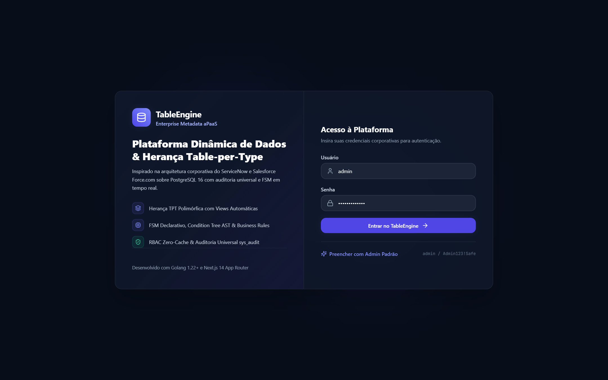

* **Destaques**: Design em Dark Mode com glassmorphism, indicador de conexão PostgreSQL 16 e preenchimento ágil para credenciais de administrador padrão.

---

## 1. Visão Geral & Métricas (Dashboard)

Painel central com métricas em tempo real sobre a engine de metadados, contagem de tabelas de negócio e de kernel, transições ativas e atalhos rápidos.

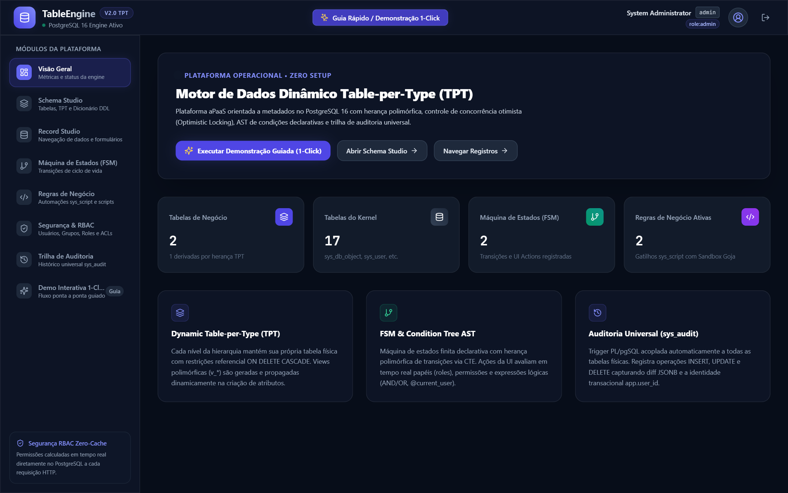

* **Módulo no Menu**: `Visão Geral` (`dashboard`)
* **Destaques**: Indicadores de Tabelas de Negócio com herança Table-per-Type (TPT), contagem de tabelas do Kernel, status das regras de negócio ativas e banner de inicialização rápida guiada.

---

## 2. Schema Studio & Dicionário DDL (Schema Editor)

Gerenciador de classes, hierarquia de herança polimórfica Table-per-Type (TPT), dicionário de campos e numeração sequencial automática.

### Catálogo de Classes & Herança
Visão geral das tabelas de negócio (`tbl_incident` herdando de `tbl_task`) e tabelas de sistema do kernel.

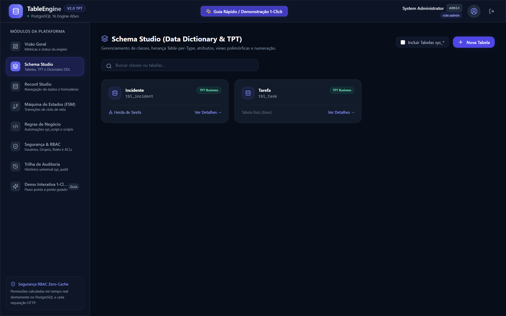

### Editor de Metadados da Classe & Dicionário de Atributos
Detalhes estruturais da entidade com resolução de linhagem via CTE recursiva, visualizando colunas herdadas do pai (`tbl_task`) e atributos especializados (`tbl_incident`).

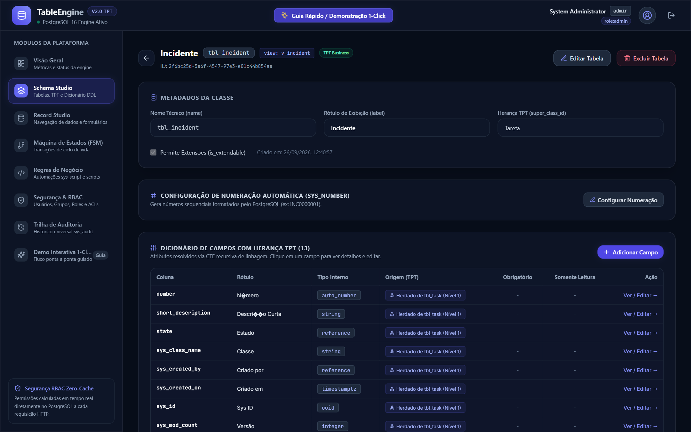

* **Módulo no Menu**: `Schema Studio` (`schema`)
* **Destaques**: Resolução automática de linhagem em tempo real, geração de Views polimórficas (`v_*`), configuração de numeração automática (`sys_number`) com prefixos formatados e isolamento DDL com `ON DELETE CASCADE`.

---

## 3. Record Studio (Navegador de Registros & Formulários)

Navegador de dados corporativos com paginação, filtros rápidos, suporte a concorrência otimista (Optimistic Locking via `sys_mod_count`) e formulários dinâmicos.

### Grade de Dados & Listagem de Registros
Visualização em tabela dos registros cadastrados com chips de status coloridos e numeração gerada pela engine.

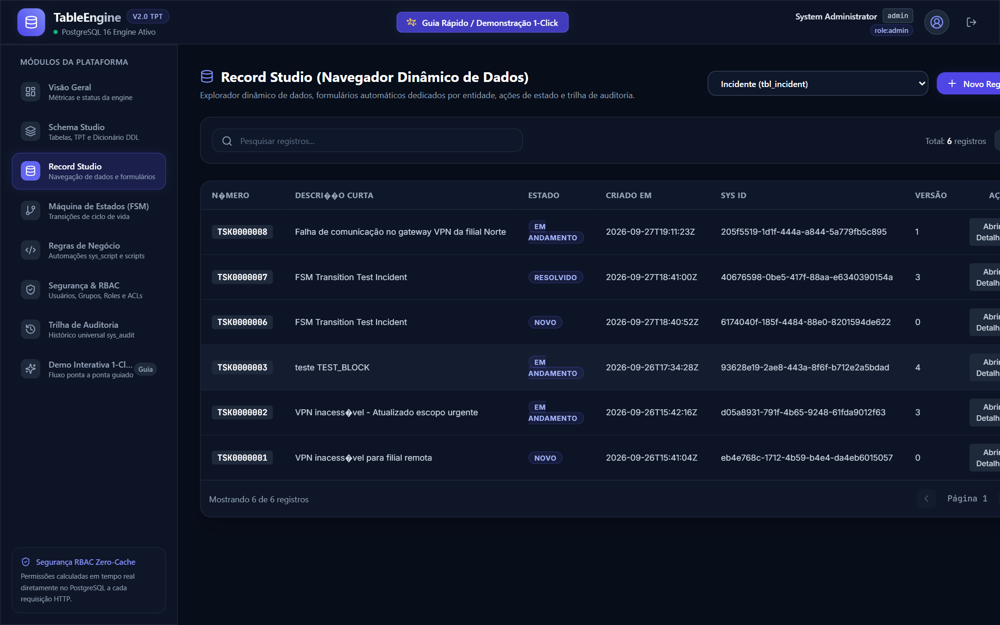

### Formulário Dinâmico & Execução de Transições FSM (UI Actions)
Formulário dinâmico do registro com botões de ação de estado gerados em tempo de execução de acordo com o papel e a condição do registro.

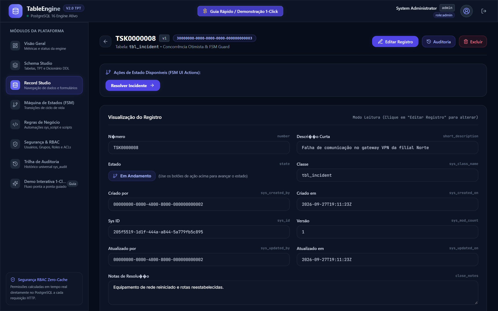

* **Módulo no Menu**: `Record Studio` (`records`)
* **Destaques**: Avaliação dinâmica de botões de transição FSM, bloqueio de conflitos de edição concorrente e acesso direto ao histórico de auditoria do registro.

---

## 4. Máquina de Estados Finita (FSM Transitions Designer)

Designer de ciclo de vida com controle estrito de avanço de estados operacionais, exigência de permissões e regras guard declarativas (AST).

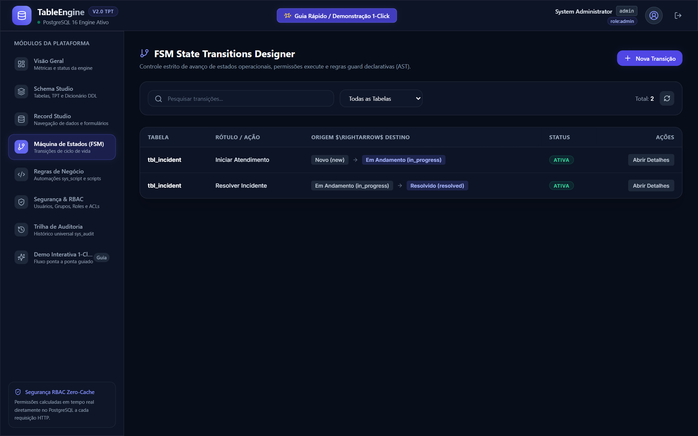

* **Módulo no Menu**: `Máquina de Estados (FSM)` (`transitions`)
* **Destaques**: Configuração visual das transições (`Novo` &rarr; `Em Andamento` &rarr; `Resolvido`), vinculação com permissões RBAC e validação com Condition Tree AST.

---

## 5. Motor de Regras de Negócio (Business Rules Engine)

Mecanismo declarativo e scriptável inspirado no `sys_script` do ServiceNow, permitindo validações síncronas antes/depois da mutação no banco de dados.

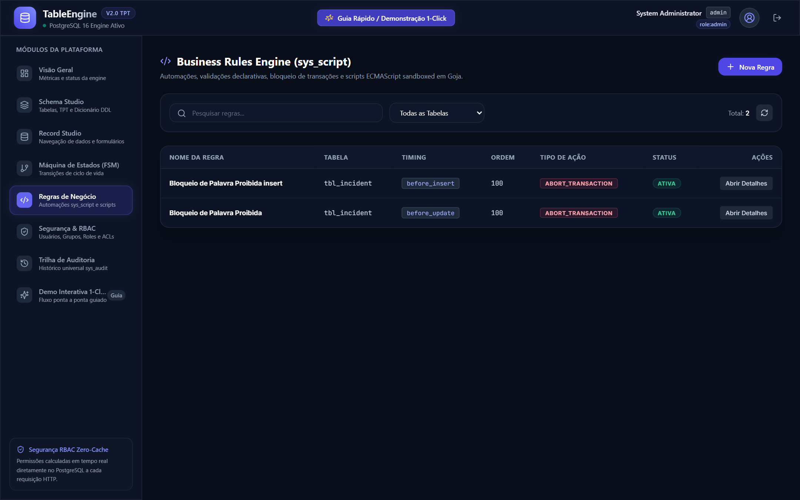

* **Módulo no Menu**: `Regras de Negócio` (`rules`)
* **Destaques**: Timings de execução (`before_insert`, `before_update`, `after`), ordenação por prioridade, bloqueio transacional (`abort_transaction`) e sandbox ECMAScript Goja em Go.

---

## 6. Segurança & Controle de Acesso (RBAC Studio)

Gestão centralizada de identidades corporativas, membros de grupos, papéis herdados e permissões granulares no PostgreSQL com arquitetura **Zero-Cache**.

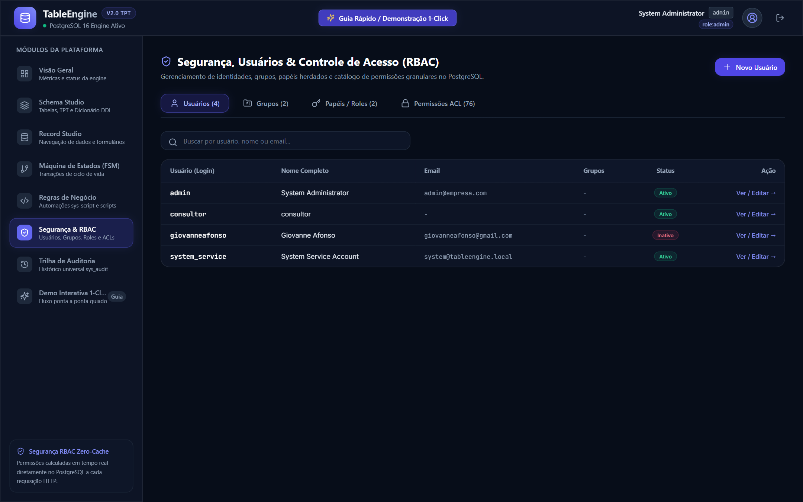

* **Módulo no Menu**: `Segurança & RBAC` (`rbac`)
* **Destaques**: Gestão de Usuários, Grupos e Roles; catálogo de ACLs com operações CRUD por tabela/campo avaliadas em tempo real a cada requisição HTTP sem risco de cache obsoleto.

---

## 7. Trilha de Auditoria Universal (sys_audit Explorer)

Explorador imutável da trilha de auditoria corporativa baseada em triggers PL/pgSQL nativos no PostgreSQL.

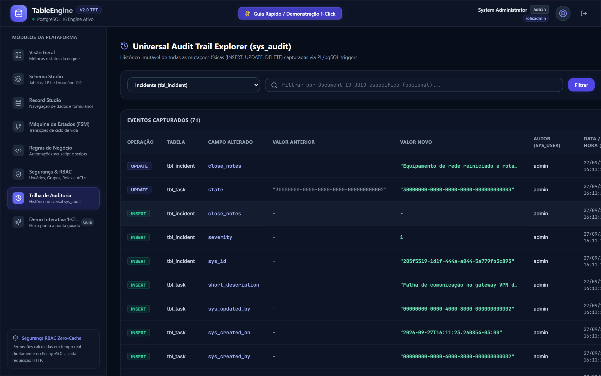

* **Módulo no Menu**: `Trilha de Auditoria` (`audit`)
* **Destaques**: Captura automática de eventos `INSERT`, `UPDATE` e `DELETE` em tuplas físicas, cálculo de `diff` entre valor anterior e valor novo, usuário transacional rastreado via `app.user_id` e timestamp microsecond-precision.

---

## 8. Demonstração Interativa 1-Click (Quickstart Tour)

Módulo interativo de execução guiada ponta a ponta da plataforma, orquestrando criação de tabelas TPT, definição de atributos, configuração de numeração, regras FSM e auditoria.

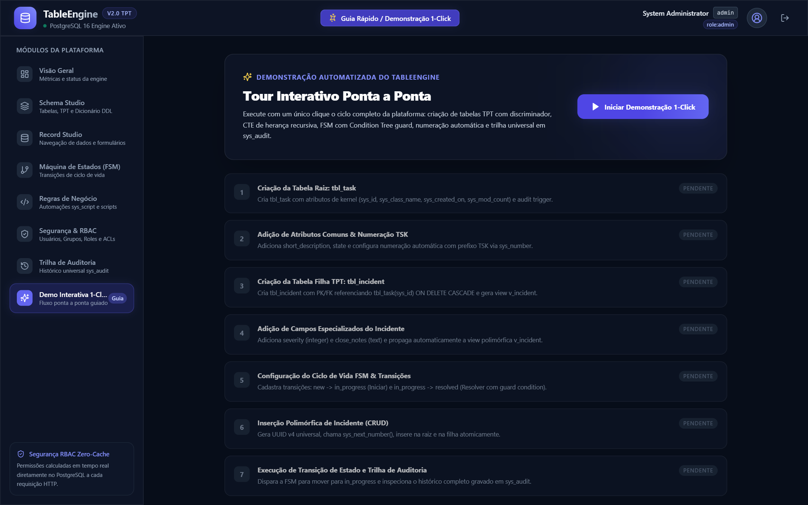

* **Módulo no Menu**: `Demo Interativa 1-Click` (`quickstart`)
* **Destaques**: Teste automatizado 100% via API com visualização em tempo real das etapas de criação do ecossistema TPT e validações operacionais.
